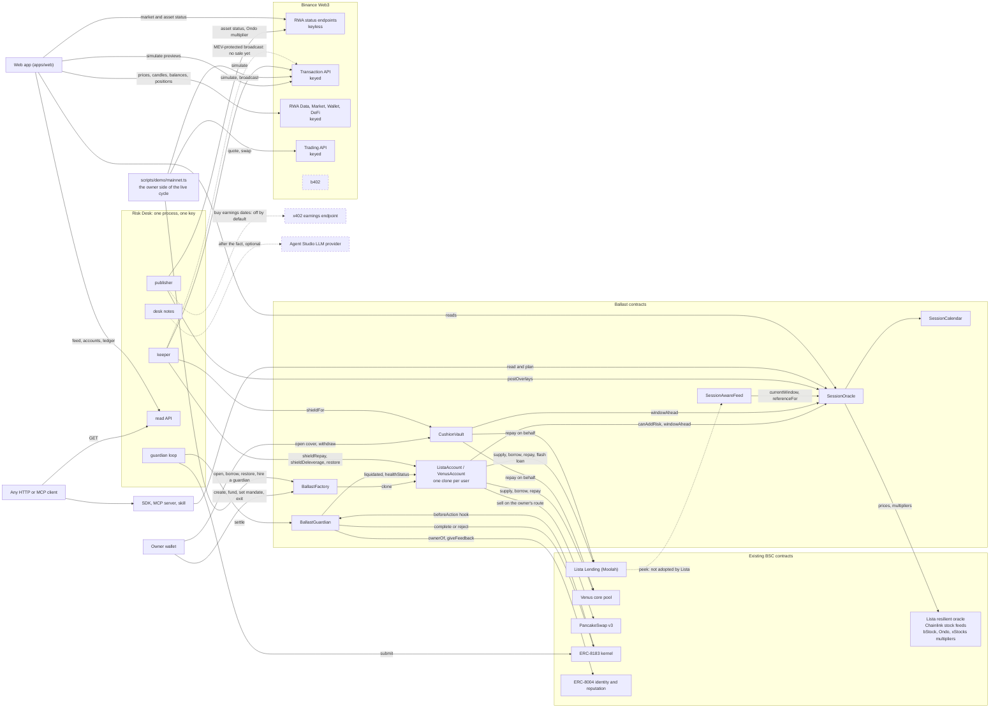

# Ballast

Ballast keeps a loan against tokenized stocks alive through every US market closure: before the close a keeper may only repay or deleverage, and a contract refuses to borrow back until the market has reopened and settled.

It is built for BNB Chain: bStock collateral on Lista Lending and Venus.

| You want | Read |
|---|---|
| To check everything in five minutes | [JUDGES.md](JUDGES.md) |
| No setup: one full cycle, step by step | https://ballast-desk.vercel.app/judge |
| Addresses, transactions, test counts | [PROOF.md](PROOF.md), rendered from data by `pnpm proof` |
| The evidence behind each statement | [CLAIMS.md](CLAIMS.md) |
| The study behind the numbers: scripts, data, a checker | [research/README.md](research/README.md) |
| What is real and what is mocked | [MOCKS.md](MOCKS.md) |
| To use the Session Oracle in your own protocol | [docs/session-oracle.md](docs/session-oracle.md) |
| To call it from an agent, nothing to install | `https://34-185-146-173.sslip.io/mcp`, see [Public MCP endpoint](#public-mcp-endpoint) |

The contracts are deployed on BSC mainnet, the desk is running against them and the app is at https://ballast-desk.vercel.app. Nothing in this README is a statement about mainnet beyond what PROOF.md lists as an address or a transaction.

## Live on BNB Chain

One real position went through the cycle on 2026-10-09. Times are UTC; every transaction is in [PROOF.md](PROOF.md), section 2.

| When | Who | What |
|---|---|---|
| 13:37 | owner | [Buys TSLAB](https://bscscan.com/tx/0x04ed824f67ad208903c1e381e90a529b29bb283a2d9e317b11a1eb4acf460681) with 5.60 USDT through the Binance Trading API, submitted by Binance's MEV-protected broadcast. [Creates](https://bscscan.com/tx/0x44c4d80b90c3e427625ff39b25cc8502247966fbdcbeaeeea430e5b4b25a70f2) Ballast Venus account `0x64b08268efb8B266c43A1751dDbB91702CA925e3` with the desk as keeper, deposits the TSLAB and borrows 2.96 USDT into the cushion (LTV 53.36%). |
| 15:08 | owner | [Calls `restore(0.05 USDT)`](https://bscscan.com/tx/0x5f6fb4c5e1bb366dfd45c22d292c219d3ac5d95f75d99ba4022d585d2902e49a) in the regular session, 98 minutes after the open. The Session Oracle answers `OK` and the borrow goes through. |
| 15:09 | owner | [Funds guard job 56956](https://bscscan.com/tx/0x8188fe89d495e8810105e6e719db118416ef97aabcb880953d178cc7afb24af2) on the ERC-8183 kernel: 0.01 USD1 in escrow, the desk as guardian, window 15:14 to 16:14. |
| 16:16 | desk | [Submits](https://bscscan.com/tx/0x3530d03e046adcc653495ab8bc6821405f3d43edfa5947df03d00663598a9c79) the hash of its [evidence file](https://34-185-146-173.sslip.io/evidence/56956) and [settles](https://bscscan.com/tx/0x598a78fc848ae61106cfc86de48c19b7c82e58bc59d6ffd11177ac83e3a54c9d) the job. The account survived the window: `BallastGuardian` pays the desk 0.01 USD1 and writes ERC-8004 feedback. |
| 19:03 | desk | By itself, 56 minutes before the weekend close: [`shieldRepay(0.18017 USDT)`](https://bscscan.com/tx/0x5a95ef60855620aa19156eccb223f1ad603df97d399e626de6828265b72104e5) from the cushion. Debt 3.0101 to 2.8299 USDT, LTV 53.95% to 50.60%. The desk's next reading of the account: it survives TSLA's 5.51% weekend gap buffer at a health factor of 1.307, against a target of 1.30. |

Two steps are not on mainnet yet, and nothing here claims them:

- **A restore refused on a closed market.** Over the weekend the owner sends the same `restore` while New York is closed, so that it is mined and reverts with `RestoreRefused(NOT_REGULAR)`. PROOF.md will list it as a revert on purpose. Until it does, the refusal is shown on a fork (`forge test --match-test test_restore_refusedOnWeekend -vv`), and `canAddRisk` can be asked on mainnet at any time ([JUDGES.md](JUDGES.md)).
- **The desk's own restore.** The contract lets a restore through only in the regular session and at least 90 minutes after the open. After Friday's shield that is Monday 12 October, 15:00 UTC, at the earliest, which is after the submission deadline. The desk borrowing back by itself on mainnet is therefore not part of this submission. The restore in the table was the owner's call; a keeper restore is shown on a fork.

## The measurement

We counted every liquidation of bStock collateral on BNB Chain from the first bStock listing to 25 September 2026 (BSC blocks 101,500,000 to 123,963,563), and measured close-to-open gaps of the underlying stocks over 6.3 years.

- **0 of 120.** None of the 120 bStock liquidations on Lista Lending happened on a weekend (Friday 20:00 to Sunday 20:00 New York time). Venus seized no bStock collateral at all.
- **81%.** Of the dollars repaid in organic liquidations, 81% landed in the first 90 minutes after the regular open; 59% in the first 90 minutes after a weekend or holiday.
- **4.4% / 5.5% / 4.3% / 17.9%.** The 99th-percentile down-gap from one close to the next open: weekday overnight, weekend, holiday, and around earnings (36 US tickers, June 2020 to September 2026).
- **81% of the week.** The NYSE regular session is 32.5 of 168 hours. The tokens trade, and the loans are priced, for the other 81%.

Loans are not lost while the market is shut. Risk builds up while it is closed and is realised when it reopens. So Ballast acts before the close, does not trust the first 90 minutes after the open, and treats earnings as a window of its own.

"Organic" leaves out 87 liquidations of dust-sized positions (about $1.0k in total) that a single account opened at the liquidation threshold. The other 33 repaid $30.6k. The scripts, the row-level data and the caveats are in [research/](research/README.md), and one command recomputes every number above from that data: `python research/check_figures.py`.

## What Ballast does

1. **One account per loan.** `BallastFactory` creates a per-user account, an EIP-1167 clone of `ListaAccount` or `VenusAccount`, that holds one bStock-collateral loan and a stablecoin cushion. The owner can do everything at any time, sets a mandate (`maxLtvBps`, `shieldLtvBps`, `maxSlippageBps`, `autoRestore`) and names a keeper.
2. **Shield before the close.** In the hour before each regular close, and for the whole session before an earnings gap, the keeper plans for a target health factor after the coming window's p99 gap (`TARGET_HF_AFTER_GAP`, 1.05 by default). It repays from the cushion (`shieldRepay`) and, on Lista only, sells collateral into debt through a Moolah flash loan and a PancakeSwap v3 route the owner fixed (`shieldDeleverage`).
3. **Restore after the open.** `restore` borrows back into the cushion only when `SessionOracle.canAddRisk` says yes: regular session, at least 90 minutes after the open, publisher overlay fresh and unflagged, on-chain price within 60 bps of a reference no older than 26 hours, and no closure within 3 hours. On a normal day that is 11:00 to 13:00 New York time. These are the deploy script's parameters; the oracle owner can move them only inside fixed bounds.
4. **Cover without moving the loan.** `CushionVault` holds a cushion for a loan that stays on the user's own address. The keeper can spend it only on that user's debt, only near a closure, and only up to the user's daily cap.
5. **Guardians paid on survival.** A guard job on BNB Chain's ERC-8183 kernel pays a guardian agent that has an ERC-8004 identity only if the account was not liquidated and is healthy after the window. `BallastGuardian` is the job's hook and evaluator and writes the outcome to ERC-8004 reputation.

The Risk Desk (`apps/agent`) is the process that runs this: the overlay publisher, the keeper, the guardian loop and a read API. Every decision in it is deterministic code. Each write is simulated before it is signed. One transaction of the desk key is in flight at a time and none is signed above a gas-price cap; when the sender cannot tell what became of a nonce it halts and signs nothing more until the chain shows the way is clear. Collateral sales go out only through Binance's MEV-protected broadcast, never to the public mempool. When it is configured, a language model writes a two-sentence note about each shield, restore and refusal afterwards; no code path reads those notes back.

The live desk runs with a target of 1.30 instead of the default 1.05. Venus lends at most 60% against TSLAB and liquidates at 70%, so even a fully drawn Venus position keeps a health factor of about 1.10 after TSLA's p99 weekend gap: at the default target the desk would have nothing to shield there. The more conservative setting lets a small Venus position exercise the whole cycle, and on 2026-10-09 it did: the desk repaid 0.18017 USDT at 19:03 UTC and took the account from LTV 53.95% to 50.60%. `/health` on the desk shows the value in force.

## How it is enforced

The keeper is a hot key on a server. These are the rules it cannot break, because the contract reverts. Names are the ones in `contracts/src`.

**Accounts** (`accounts/BallastAccountBase.sol`, `accounts/ListaAccount.sol`, `accounts/VenusAccount.sol`)

| Rule | Function or modifier | Revert |
|---|---|---|
| The keeper can call three functions. Everything else is the owner's: `borrow`, `withdrawCollateral`, `withdrawCushion`, `setMandate`, `setKeeper`, `setDeleveragePath`, `rescue`. | `onlyOwner`, `onlyKeeperOrOwner` | `NotOwner()`, `NotKeeper()` |
| A repay spends only the account's own balance; debt must fall and collateral must not change. | `shieldRepay(assets)` | `InsufficientCushion(have, need)`, `RiskNotReduced()`, `BelowMinLoan(remaining, minLoan)` |
| A restore needs the Session Oracle's yes. | `restore(assets)` | `RestoreRefused(reason)` |
| A restore borrows to the account itself, never to the caller, and never above the owner's cap. | `restore(assets)` | `ExceedsMandate(ltvBps, maxLtvBps)` |
| The keeper restores only while the owner leaves `autoRestore` on. | `restore(assets)` | `KeeperRestoreDisabled()` |
| A sale uses only the swap path whose hash the owner stored. | `shieldDeleverage(repayAssets, collateralToSell, path, minOut)` | `DeleverageDisabled()`, `BadPath()` |
| A sale happens only above the owner's shield LTV. | `shieldDeleverage` | `BelowShieldLtv(ltvBps, shieldLtvBps)` |
| A sale happens only when the next closure starts within the oracle horizon (3 hours), or while the loan is above the owner's cap. | `shieldDeleverage` | `NotInShieldWindow()` |
| A sale must lower the LTV and may not land more than 100 bps under its floor (the shield LTV in the window, the cap outside it). | `shieldDeleverage` | `RiskNotReduced()`, `OverDeleverage(ltvAfterBps, shieldLtvBps)`, where the second value is the floor |
| The swap must return at least the larger of the caller's `minOut` and the venue oracle value less `maxSlippageBps`. Proceeds go to the account. | `onMoolahFlashLoan` | the router's own revert |
| The flash-loan callback answers only Moolah, and only inside the account's own flash loan. | `onMoolahFlashLoan` | `Unauthorized()` |
| A keeper sale first puts the cushion on the debt in the same transaction and sells nothing if that is enough. A sale that does happen switches `autoRestore` off until the owner sets it again. | `shieldDeleverage` | event `MandateSet(.., false)` |
| The mandate itself is bounded: cap at most 90% and, on Lista, below the market's liquidation LTV; slippage at most 5%; shield LTV below the cap. | `setMandate` | `BadMandate()` |

What a stolen keeper key can do with that: repay debt from the cushion at any time; inside the pre-closure window, sell collateral down to the owner's shield LTV (at most 100 bps under it) at no worse than `maxSlippageBps` under the venue oracle price; borrow back into the cushion when the oracle allows it and the owner left `autoRestore` on. It cannot send a token to any address other than the venue, the owner's swap route and the account itself. Venus accounts have no sale path at all.

**Vault** (`CushionVault.sol`)

| Rule | Function | Revert |
|---|---|---|
| Only the keeper the user named for that cover. | `shieldFor(user, key, amount)` | `NotCoverKeeper()` |
| Not in the regular session while the next closure is known to be more than 3 hours away. | `canShieldNow(symbol)` | `OutsideShieldWindow()` |
| At most `capPerDay` per 24 hours, and only from that user's balance. | `shieldFor` | `OverDailyCap(used, cap)`, `InsufficientCover(have, need)` |
| Only as a repayment of that user's debt on the venue. | `shieldFor` | `NoDebt()`, `BelowMinLoan(remaining, minLoan)` |
| The user withdraws at any time. The vault has no way to borrow. | `withdraw(key, amount, to)` | |

**Session Oracle** (`SessionOracle.sol`, `SessionCalendar.sol`)

| Rule | Function | Revert or answer |
|---|---|---|
| The calendar has no admin and no oracle: constants for 2026 and 2027. Outside them every answer is unknown and risk may not be added. | `SessionCalendar.session(ts)` | `Session.UNKNOWN`, then `Reason.CALENDAR_UNKNOWN` |
| Only the publisher posts overlays. The deploy script refuses to make the owner's address the publisher on mainnet. | `postOverlays(syms, data)` | `NotPublisher()` |
| An overlay lives at most 6 hours. An expired overlay means no. | `postOverlays`, `canAddRisk` | `BadValidity()`, `Reason.OVERLAY_STALE` |
| A posted Ondo multiplier must sit between the on-chain sValue and 100 bps above it. | `postOverlays` | `OndoMultiplierOutOfBounds(posted, onchain)` |
| A posted reference price is accepted only for tickers without a Chainlink feed, only in the regular session, within 300 bps of the on-chain per-share price. | `postOverlays` | `ReferenceNotAllowed()`, `ReferenceOutOfBounds(posted, perShare)` |
| Flags can only block. A posted earnings date can only raise the gap buffer of the window it lands in. | `canAddRisk`, `windowAhead` | `Reason.FLAGGED` |

**Guardian** (`BallastGuardian.sol`)

| Rule | Function | Revert |
|---|---|---|
| Anyone can settle, but only a job the hook bound, after its window, in kernel status Submitted. A job that was never submitted is refunded by the kernel's `claimRefund` at expiry. | `settle(jobId)` | `NotSettleable()`, `WindowNotOver()` |
| The outcome is read from the account, not reported by anyone: `liquidated()`, then `healthStatus()`. Unknown health never settles. | `settle(jobId)` | `CannotEvaluateNow()` |
| At funding: the account comes from the factory and belongs to the client, has debt and no recorded seizure; the window is at least 1 hour and has not started more than 5 minutes ago; the job expires at least 1 hour after the regular open that follows the window; the budget is at least the guardian's minimum; the provider is the owner or agent wallet of the ERC-8004 id in the terms; the client is none of those. | `beforeAction` on `fund` | `BadTerms()`, `NotAccountOwner()`, `BudgetTooLow()`, `ProviderNotAgent()` |
| The provider submits only after the window has ended. | `beforeAction` on `submit` | `WindowNotOver()` |

The tests behind these rows are listed in [PROOF.md](PROOF.md), section 4.

## Architecture



Solid arrows are call paths that exist in the code and are executed by the test suites (unit, or fork against real mainnet state). Whether they also run on mainnet is PROOF.md's job to say, not this diagram's.

Dashed arrows and dashed boxes are in the repository but not wired, off by default, or not yet run against the live service:

- **Lista to SessionAwareFeed.** No lender reads the feed. It is shown on a market created inside a fork test.
- **Keeper to the Transaction API, broadcast.** `simulate` is live: the mainnet desk simulates its writes through it, the Friday shield included. The MEV-protected `broadcast` is the only route the desk has for a collateral sale (`apps/agent/src/desk/tx.ts`), and no sale has gone through it: the one live account is on Venus, which has no sale path. The same endpoint did carry the owner's TSLAB buy from the demo script.
- **Publisher to an x402 endpoint.** The buyer exists (`apps/agent/src/desk/x402.ts`, `earnings.ts`) and is off until `X402_EARNINGS_URL` is set. It has never paid a live merchant.
- **Desk notes to an LLM.** On only when the Agent Studio project's LLM provider has a key. Notes are written after the event and never read by a decision. On 2026-10-09 the live desk ran without them: `/health` showed `notes: "off"`.
- **b402.** A typed client with unit tests in `packages/binance`. Nothing calls it.

## The Session Oracle as a primitive

The accounts are one consumer of the Session Oracle. Any lender, vault or agent that prices tokenized US stocks can read the same pieces.

| Piece | What it gives you | Where |
|---|---|---|
| Calendar | The NYSE session at any timestamp (`REGULAR`, `PRE`, `POST`, `OVERNIGHT`, `CLOSED_WEEKEND`, `CLOSED_HOLIDAY`, `UNKNOWN`), the next open and close, the closure ahead and the closure in progress. US Eastern time with DST, holidays and 13:00 early closes for 2026 and 2027, as constants. | `SessionCalendar` |
| Per-share normalisation | One USD price per share of the underlying (`perSharePrice`), from the bStock's raw-unit feed divided by its EIP-8056 `uiMultiplier`. Shares per token for each wrapper (`sharesPerToken`): bStock `uiMultiplier`, xStocks `multiplier`, Ondo from the bounded overlay with the on-chain sValue as a fallback flagged stale. One share price, three token units. | `SessionOracle` |
| Reference and age | The independent reference for a ticker and when it was last updated (`referenceFor`), and whether the on-chain price has converged to it (`converged`). Chainlink for 10 of the 12 listed tickers, a bounded publisher print for the 2 without a feed. | `SessionOracle` |
| Windows and the decision | The next closure and its p99 gap buffer per ticker (`windowAhead`), the closure in progress (`currentWindow`), and one decision: `canAddRisk(symbol)` with a reason code. | `SessionOracle` |
| Lender adapter | A drop-in price source with Lista's oracle interface, `peek(address) returns (uint256)`, 8 decimals, raw token units. In the regular session it passes the upstream price through. While the market is closed it clamps the price to a band around the last reference: the band starts at the ticker's gap buffer for the closure in progress, widens by one base band per 24 hours closed, and is capped at three. | `SessionAwareFeed` |

A fork test creates two identical SPYB/USD1 markets at an 85% liquidation LTV, one priced by Lista's oracle and one by `SessionAwareFeed`, and opens the same loan at health factor 1.043 in each. A -5% print twelve hours after Friday's close liquidates the first and not the second (the band is 334 bps at that hour). The same -5% still standing 90 minutes into Monday's regular session liquidates both: the feed delays a move it cannot confirm, it does not hide one that is real.

```bash
cd contracts && forge test --match-path "test/fork/SessionAwareFeed.fork.t.sol" -vv
```

Why a band at all: over 597 weekends the token's Saturday and Sunday price explained at most 0.2 (R2) of the stock's Monday gap, and only once the US venues were trading again did it converge, to a correlation of 0.97 by 09:00 New York time on Monday. A price that carries that little information should not be able to liquidate anyone on its own.

Interface, read patterns, adapter wiring and the MCP tools are in [docs/session-oracle.md](docs/session-oracle.md).

## Binance Web3 API usage

`packages/binance` is one client for two surfaces: the keyless public RWA endpoints (`src/public.ts`) and the keyed Web3 API with HMAC `X-OC-*` signing (`src/client.ts`, `src/sign.ts`, `src/modules/*`). Every call from either surface is written to a probe (`src/probe.ts`); the desk serves the latency and error-code summary at `/api-health` and the MCP server as the `api_health` tool.

What the product calls, where, and what it loses without it:

| Module | Endpoints | Called from | Used for | Without it |
|---|---|---|---|---|
| RWA status, keyless | `assetStatus`, `dynamic` | `apps/agent/src/desk/publisher.ts` | The desk's overlay. Per bStock: halt, corporate action, limited-asset and earnings reasons become flags. Per Ondo token: the live shares multiplier, and the underlying price that is the reference for tickers without a Chainlink feed. | No overlay is posted for that symbol. The last one expires within 6 hours, `canAddRisk` answers `OVERLAY_STALE` and restores stop. Shields keep working. |
| RWA status, keyless | `marketStatus`, `assetStatus` | `apps/web/lib/server/handlers/rwa.ts` (`/api/rwa-status`), `packages/mcp/src/tools.ts` (`tokenized_stock_status`) | `/oracle` shows the US session as Binance sees it next to the on-chain calendar, and each token's status. The MCP tool answers the same for any token. | The page and the tool lose Binance's view; the on-chain calendar is still shown. |
| RWA Data, keyed | `price` | `apps/web/lib/server/handlers/market.ts` (`/api/market/prices`) | The cross-issuer table on `/oracle`: Binance's price of the bStock, Ondo and xStocks token of each ticker, turned into a price per share with the on-chain multipliers. | The table says the prices are unavailable. |
| Market, keyed | `candles` | `apps/web/lib/server/handlers/market.ts` (`/api/market/candles`) | The hourly chart on `/oracle` that the closed-market band is drawn against. | The chart falls back to the keyless `klines` endpoint of the same client. |
| Transaction, keyed | `simulate` | `apps/agent/src/desk/tx.ts`; `apps/web/lib/server/handlers/simulate.ts` (`/api/simulate`); `scripts/demo/mainnet.ts` | Desk: every write is simulated here before it is signed, next to `eth_call`; for a restore a disagreement between the two stops the send. App: every transaction is previewed before the wallet is asked to sign. | Desk and app go by `eth_call` alone. |
| Transaction, keyed | `broadcast` | `apps/agent/src/desk/tx.ts`; `scripts/demo/mainnet.ts` | The MEV-protected route. It is the only way the desk sends a collateral sale, and the demo script uses it for the collateral buy. | The desk does not sell: sales are disabled and shields repay from the cushion only. The script sends through its RPC. |
| Trading, keyed | `quote`, `approveTransaction`, `swap` | `scripts/demo/mainnet.ts` (`open-venus`) | Buys the few dollars of TSLAB that become the collateral of the live demo position. | The script buys in the PancakeSwap v3 pool from the config and says so. |
| Wallet, keyed | `allTokenBalances` | `apps/web/lib/server/binance-data.ts` (`/api/wallet-stocks`) | The collateral picker in `/app`: every tokenized stock the connected wallet holds, with prices. | The same tokens are read from the chain, and the answer says which source it used. |
| DeFi, keyed | `positions` | `apps/web/lib/server/handlers/reads.ts` (`/api/loans`) | Loan import in `/app`: the wallet's Lista and Venus loans are read on chain, and the DeFi API adds Binance's own summary of the wallet's positions next to them. | The loans still load from the chain; the summary is missing. |

In the client with tests and no caller: keyless `stockList` and `meta`; Transaction `gasPrice` and `orders`; RWA Data `platforms`, `search`, `tokens`, `underlyingProfile`, `underlyingMarket`; Market `price` and `tokenSearch`; Trading `submitRfqOrder` and `order`; Wallet `txDetail`; DeFi `protocols`, `investments`, `deposit`, `redeem`; all of b402. The desk's x402 buyer signs EIP-3009 payments itself and does not call b402.

What has run against the live API:

- **Keyless RWA status and `simulate`, by the desk.** Its calls are counted in its own `/api-health` (URL in [JUDGES.md](JUDGES.md)): the two keyless endpoints on every publisher run, `simulate` on every write it prepares. On 2026-10-09 at 19:17 UTC, nine hours after its last restart, that was 672 calls to each keyless endpoint and 33 to `simulate`, none failed. The counters restart with the desk. The shield of that day carries `sim.via: "binance"` in the feed.
- **Trading `quote`, `approveTransaction`, `swap`.** They produced the owner's collateral buy on 2026-10-09: the approval went to the spender the quote named, and the swap built by the API is [this transaction](https://bscscan.com/tx/0x04ed824f67ad208903c1e381e90a529b29bb283a2d9e317b11a1eb4acf460681), 5.60 USDT for about 0.0145 TSLAB through the vendor LiquidMesh.
- **Transaction `broadcast`.** The demo script submitted that buy through `broadcast` with MEV protection on, and logged the route it used. The chain shows the swap, not how it was submitted, so the route is our own record. `broadcast` has not carried a collateral sale: the one live account is on Venus and cannot sell.
- The web app's keyed calls run on the server side of the deployed app when a wallet uses `/app` or someone opens `/oracle`. `apps/web/scripts/binance-smoke.ts` exercises the Wallet, DeFi and simulate calls against the live API with a key.

The client also handles what the API asks of a caller: three different success codes, a limit of 5 requests per second per endpoint, retries on 429 that honour `Retry-After`, no retry of a state-changing POST after a timeout, and the geo-block code `40304`, which is recognised and never retried.

The live test for the keyed API is `packages/binance/test/live.test.ts`. It is skipped without `BINANCE_WEB3_API_KEY` and `BINANCE_WEB3_API_SECRET`, which is why `pnpm test` reports 2 skipped.

## Agent Studio, ERC-8004 and ERC-8183

**BNB Agent Studio.** `apps/agent/app/agent` is a Studio project created with `bag init`: `studio.toml`, the A2A and MCP faces, and the Studio signing code, on `@bnbagent/studio-runtime` and `@bnbagent/sdk`. The desk uses three things from it:

- the Studio keystore: the desk key can be a Web3 Secret Storage v3 file from `.studio/wallets`, decrypted with the Studio SDK (`apps/agent/src/desk/account.ts`);
- the Studio LLM configuration: desk notes resolve the `[llm]` provider of `studio.toml` through the Studio runtime (`apps/agent/src/desk/notes.ts`);
- the A2A and MCP faces from `bag dev`, bound to loopback. On chain 56 the desk config refuses any other bind address, because the self-hosted faces have no inbound auth.

It does not use Studio's ERC-8183 seller rail. That rail is switched off in `studio.toml` (`[payments.erc8183] enabled = false`), so the faces advertise no `negotiate` or `notify_funded` skill and nobody can make the desk spend gas on free jobs. Guard jobs go through Ballast's own evaluator instead. The desk is self-hosted under systemd (`deploy/`), not on Studio's managed runtime.

**ERC-8004.** `apps/agent/src/desk/register.ts` mints the desk's identity in the registry at `0x8004a169fb4a3325136eb29fa0ceb6d2e539a432` and writes its registration file. The file is built from explicit flags: besides the web app and the agent wallet it lists only the endpoints named on the command line, so it cannot advertise a service that is not served. The live file of agent 368122, stored on chain as the token URI, lists `web`, `MCP`, `desk-api` and `agentWallet`. It has no A2A service, because the Studio A2A face is not public, and `x402Support` is `false`, because the desk sells nothing over x402. The id is used in three places on-chain: `SessionOracle.publisherAgentId` names the publisher; `BallastGuardian` requires a job's provider to be the owner or agent wallet of the id in the job terms; and every settlement writes `giveFeedback(agentId, 100 or 0, 0, "ballast-guard", "window", ...)` to the reputation registry at `0x8004baa17c55a88189ae136b182e5fda19de9b63`.

**ERC-8183.** Guard jobs live on BNB Chain's AgenticCommerce kernel at `0xea4daa3100a767e86fded867729ae7446476eba6`. The client calls `createJobWithToken` with `BallastGuardian` as both evaluator and hook, `setBudget`, then `fund` with the terms (account, window start and end, guardian agent id). The hook binds the terms. After the window the provider calls `submit` with a deliverable: the keccak256 of an evidence file holding the desk's own feed events for that account in that window, served byte for byte at `/evidence/<jobId>`. Then anyone calls `BallastGuardian.settle`, which calls `complete` or `reject` on the kernel.

Job 56956 went through all of it on mainnet on 2026-10-09 (PROOF.md): funded by the account's owner with 0.01 USD1, submitted and settled by the desk two minutes after its window, paid to the desk. Its evidence file is at https://34-185-146-173.sslip.io/evidence/56956 and hashes to the deliverable in the submit transaction ([CLAIMS.md](CLAIMS.md), D5). The window was one hour inside the regular session, so the file lists no desk events: this job shows the escrow, the bound terms, the evaluation and the payment on mainnet, not a guardian earning its fee across a closure.

## Public MCP endpoint

The Ballast MCP server is public, over Streamable HTTP:

```
https://34-185-146-173.sslip.io/mcp
```

Client configuration, one line, for any MCP client that speaks Streamable HTTP:

```json
{ "mcpServers": { "ballast": { "type": "http", "url": "https://34-185-146-173.sslip.io/mcp" } } }
```

It is unauthenticated, read and plan only, and rate limited. It holds no key, signs nothing and sends nothing; each client address gets a number of requests a minute (120 is the server's default), and heavy chain reads are capped. It reads the mainnet deployment in `contracts/deployments/56.json`.

| Tool | Answers |
|---|---|
| `session_state` | The market session on the Ballast calendar, the next close and open, the next and the current closure window. |
| `oracle_price` | The Session Oracle's read for a tokenized stock: prices, `canAddRisk` and why, the window ahead with its gap buffer, the overlay. |
| `position_risk` | A Ballast account's collateral, debt and cushion, its health factor now and after the coming gap, and the shield or restore plan. |
| `plan_shield` | The ordered account calls that keep an account above the target health factor through the next closure. A plan: nothing is signed or sent. |
| `list_accounts` | Ballast accounts, all or by owner. |
| `guardian_jobs` | ERC-8183 guard jobs evaluated by `BallastGuardian`, with account, window and status. |
| `tokenized_stock_status` | Binance's keyless status of a tokenized stock token: open or closed, and why. |
| `api_health` | Calls, failures and latency of the Binance public API as this server has seen them. |

Check it without a client:

```bash
curl -s https://34-185-146-173.sslip.io/mcp -H "content-type: application/json" -H "accept: application/json, text/event-stream" \
  -d '{"jsonrpc":"2.0","id":1,"method":"tools/list"}'
```

The same URL is the `MCP` service in the desk's ERC-8004 registration file. `skill/SKILL.md` tells an agent when to call the tools; running the server yourself is under Quick start, and serving it publicly is in `deploy/README.md`.

## Quick start

Node 22 or newer, pnpm 9, and Foundry for the contracts.

```bash
git clone --recurse-submodules https://github.com/RaYYeR220/ballast
cd ballast
pnpm install
pnpm test                                        # 1001 TypeScript tests: SDK, risk model, Binance client, MCP, desk, web app
cd contracts
forge test --no-match-path "test/fork/*"         # 57 contract unit tests, no network
forge test --match-path "test/fork/*"            # 99 fork tests against real BSC mainnet state
```

The fork tests fork BSC at the chain head through `https://bsc-rpc.publicnode.com` and take about 20 seconds after the first compile. Set `BSC_RPC_URL` to use another endpoint, and `FORK_BLOCK` to pin a block (that needs an archive endpoint). `pnpm contracts:test` and `pnpm contracts:test:fork` run the same two commands from the repository root.

Current counts and the date of the last full run are in [PROOF.md](PROOF.md), section 3. One web test follows the wall clock and fails while the New York regular session is open (09:30 to 16:00 Eastern time on trading days): in those hours `pnpm test` shows 1000 passed and 1 failed. PROOF.md names the test.

**No setup.** https://ballast-desk.vercel.app/judge plays one full cycle step by step, with the transaction, the decoded result or revert and the account after each step. It is a recording made on a fork of BNB Chain against the deployed contracts ([MOCKS.md](MOCKS.md) says what the fork changed), and a step links its mainnet transaction once there is one.

**The measurement and the backtest**

```bash
python research/check_figures.py     # recomputes every figure of the measurement from the committed data
pnpm backtest                        # replays data/closure-windows.json, rewrites data/backtest-lltv75.json
```

The checker needs Python 3.9 or newer and nothing else. Rebuilding its data from the chain and from public market data is described in [research/README.md](research/README.md).

**The fork demo.** One Lista account, one CushionVault cover and one guard job, kept by a desk on a local fork, with the clock moved by hand. It needs an RPC endpoint that keeps serving the forked block for the length of the demo: an archive endpoint or a provider key. The keyless public endpoints stop answering for that block after a few minutes.

```bash
# terminal 1: a local fork of BSC
anvil --fork-url "$BSC_RPC_URL" --chain-id 31337

# terminal 2: build, deploy (anvil account 1 deploys, anvil account 0 is the desk key), then set the scene
cd contracts
forge build
PUBLISHER_ADDRESS=0xf39Fd6e51aad88F6F4ce6aB8827279cffFb92266 forge script script/Deploy.s.sol \
  --rpc-url http://127.0.0.1:8545 --broadcast \
  --private-key 0x59c6995e998f97a5a0044966f0945389dc9e86dae88c7a8412f4603b6b78690d
cd ..
npx tsx scripts/demo/fork-demo.ts setup

# terminal 3: the desk, sending for real on the fork, every loop every 5 seconds
CHAIN_ID=31337 BSC_RPC_URL=http://127.0.0.1:8545 DRY_RUN=false FORK_TICK_SEC=5 \
  AGENT_PRIVATE_KEY=0xac0974bec39a17e36ba4a6b4d238ff944bacb478cbed5efcae784d7bf4f2ff80 pnpm desk

# terminal 2 again: move the clock and watch
npx tsx scripts/demo/fork-demo.ts warp lead      # 59 minutes before the close: the keeper shields
npx tsx scripts/demo/fork-demo.ts warp end       # past the guard window: the desk submits and settles
npx tsx scripts/demo/fork-demo.ts status
curl -s "http://127.0.0.1:8787/feed?limit=20"
```

Both keys are anvil's published development keys and are worth nothing outside a local node. [MOCKS.md](MOCKS.md) lists what the demo replaces on the fork.

**The web app.**

```bash
cp apps/web/.env.example apps/web/.env.local     # chain id, RPC, desk API; the Binance keys are optional
pnpm --filter @ballast/web dev                   # http://localhost:3000
```

Pages: `/` the measurement, `/app` credit lines and covers, `/oracle` the Session Oracle explorer, `/guardians` guard jobs, `/evidence` the study, `/judge` the recorded cycle. Without Binance keys the app falls back to chain reads and keyless endpoints where it can.

**The live cycle.** `scripts/demo/mainnet.ts` is the owner's side of the cycle on mainnet, one small step at a time, and a dry run unless it is told to send. `open-venus` buys a few dollars of TSLAB (through the Binance Trading API, or the PancakeSwap pool if that fails), opens a Venus account kept by the desk and borrows into its cushion. `restore` is the owner calling `restore` in the regular session, when the oracle allows it. `guardian-job` hires the desk as guardian for a window. `refused-restore` sends the same `restore` while the market is closed, so that it is mined and reverts with `RestoreRefused`. In between, the desk shields the account before the close by itself. The script may spend at most 6 USDT and 0.001 BNB of gas, appends every transaction it sends to `data/proof-txs.json`, and `pnpm proof` turns that file into PROOF.md. `open-venus`, `restore` and `guardian-job` ran on 2026-10-09 and their transactions are in PROOF.md; `refused-restore` has not been sent yet (see "Live on BNB Chain").

**The MCP server.** Eight read and plan tools over stdio or Streamable HTTP. It holds no key and sends nothing. The hosted one is above ("Public MCP endpoint"); to run your own:

```bash
BSC_RPC_URL=https://bsc-dataseed.bnbchain.org npx tsx packages/mcp/bin/ballast-mcp.ts            # stdio
BSC_RPC_URL=https://bsc-dataseed.bnbchain.org npx tsx packages/mcp/bin/ballast-mcp.ts --http     # http://127.0.0.1:8787/mcp
```

It reads `contracts/deployments/<CHAIN_ID>.json`, chain 56 by default. Against the fork above, set `CHAIN_ID=31337 BSC_RPC_URL=http://127.0.0.1:8545`, and pass `--port` in HTTP mode, because the desk's read API already holds 8787.

**The skill.** `skill/SKILL.md` teaches an agent when to call those tools and what not to recommend while `canAddRisk` is false. Copy the `skill` directory into your agent's skills directory and register the MCP server as shown in the file.

**The desk on a server.** `deploy/README.md` is the systemd and Caddy setup. `apps/agent/README.md` has every environment variable. `DRY_RUN` defaults to true: the desk simulates every write and sends nothing until you turn it off.

| Variable | Used by | Meaning |
|---|---|---|
| `BSC_RPC_URL` | fork tests, desk, MCP server, `verify:onchain` | RPC endpoint. The desk treats it as a secret, and needs one that serves `eth_getTransactionReceipt` and accepts batched `eth_call`: not every public endpoint does (`deploy/README.md`). |
| `FORK_BLOCK` | fork tests | Pin the fork to a block. Unset means the chain head. |
| `CHAIN_ID` | desk, MCP server, `verify:onchain` | `56` for BSC, `31337` for a local fork. |
| `DEPLOYMENT_FILE` | desk, MCP server, `verify:onchain` | Defaults to `contracts/deployments/<CHAIN_ID>.json`. |
| `BINANCE_WEB3_API_KEY`, `BINANCE_WEB3_API_SECRET` | desk, live test | Optional. Unset means keyless endpoints, `eth_call` simulation and plain RPC broadcast. |
| `DRY_RUN` | desk | Defaults to `true`. |

## Repository map

| Path | What is in it |
|---|---|
| `contracts/src` | `SessionCalendar`, `SessionOracle`, `SessionAwareFeed`, `CushionVault`, `BallastGuardian`, `accounts/` (`BallastFactory`, `BallastAccountBase`, `ListaAccount`, `VenusAccount`) |
| `contracts/test` | Unit tests against mocks; `fork/` runs against BSC mainnet state |
| `contracts/script/Deploy.s.sol` | The deploy script. Writes `contracts/deployments/<chainId>.json` on a real broadcast only. |
| `packages/risk` | Calendar mirror of the contract, issuer normalisation, position math, shield and restore planner, backtest |
| `packages/sdk` | Typed reads, the plan bridge from chain state to calls, calldata builders, revert decoding |
| `packages/binance` | Binance Web3 client: keyless RWA endpoints, keyed modules, signing, rate limiter, call probe |
| `packages/mcp` | MCP server with eight read and plan tools |
| `apps/agent/src/desk` | The Risk Desk: publisher, keeper, guardian loop, ledger, x402 buyer, notes, read API |
| `apps/agent/app/agent` | The BNB Agent Studio project: A2A and MCP faces, `studio.toml` |
| `apps/web` | The web app (Next.js): the landing page, `/app`, `/oracle`, `/guardians`, `/evidence`, `/judge`, and the server routes that call Binance, the desk and the chain |
| `skill` | Agent skill for the MCP tools |
| `scripts` | `proof.ts` (renders PROOF.md), `verify-onchain.ts` (checks a deployment), `demo/mainnet.ts` (the owner's side of the live cycle), `demo/record-replay.ts` (records the cycle `/judge` plays), `demo/fork-demo.ts`, `export-abis.ts` |
| `config` | BSC addresses and per-ticker gap buffers, the NYSE calendar, the operator's earnings schedule |
| `research` | The measurement: scanner and gap-study scripts, their data, and `check_figures.py` |
| `data` | Closure windows of 77 bStocks, the backtest result, and the inputs of PROOF.md |
| `deploy` | systemd units, environment templates and the server guide for the desk and the public MCP endpoint |

## Honest limits

- **Mainnet.** The contracts, the desk and the app are live. One Venus account has been opened, restored by its owner, guarded through one job and shielded by the desk; the transactions are in PROOF.md. A restore refused on a closed market is not on mainnet yet. The desk's own restore cannot happen before Monday 12 October, 15:00 UTC, which is after the submission deadline. Lista accounts, flash deleverage, the vault on Lista and the feed are proven on a fork of mainnet state, not with a live Lista loan.
- **The live position is small, and so is what it proves.** 5.60 USDT of TSLAB as collateral, a shield of 0.18 USDT, a guard job of 0.01 USD1. The job's window was one hour of the regular session, not a closure, and its evidence file lists no desk events. The Friday shield is the only time the desk has acted ahead of a real closure.
- **The replay is a recording.** `/judge` plays a cycle recorded on a fork with the clock moved and prices frozen. It shows what the deployed contracts do; the mainnet transactions are the ones in PROOF.md.
- **The live desk is tuned for the demonstration.** It runs with a target health of 1.30, not the default 1.05, so that a small Venus position has something to shield.
- **One incident so far: an RPC that would not serve receipts.** The public endpoint the desk first used (`bsc-rpc.publicnode.com`) answers `eth_getTransactionReceipt` with HTTP 403, "Archive requests require a personal token", even for a transaction mined a second ago. The desk could not see its own receipts: it recorded its first 11 overlay posts (nonces 2 to 12, 2026-10-08) as dropped and two more (nonces 13 and 15, 2026-10-09 about 01:07 and 06:10 UTC) as pending. All 13 were mined. Nothing on chain was affected; the desk's feed of those hours was wrong. Since then the sender waits for late receipts and never reports a transaction the node knows as dropped, and the desk runs on an endpoint that serves receipts and accepts batched `eth_call`. `deploy/README.md` says how to test an endpoint first, and PROOF.md carries the note.
- **The publisher costs gas every ten minutes.** CRCL and MSTR have no Chainlink feed, so the publisher posts their reference price itself whenever it has moved more than 20 bps, and it looks every ten minutes. In the regular session that makes a transaction about every ten minutes: 30 overlay posts on 2026-10-09, 28 of them inside the session, between 13:33 and 18:55 UTC. By 19:25 UTC the desk's ledger for that day showed 33 transactions and 0.00047 BNB of gas, against 0.01 USD1 earned.
- **The damage so far is small.** The 120 liquidations repaid $31.6k in total and left no bad debt. Ballast is built for where the data says the risk concentrates, not in answer to a loss that has already happened.
- **The measurement is small and uses a proxy.** Three and a half months, $31.6k of liquidations, and Binance spot prices standing in for the lending oracle. Re-running the scans needs an archive node. `research/README.md` lists the caveats.
- **Gap buffers are statistics.** A p99 is exceeded one time in a hundred. In the backtest two shielded positions were still liquidated, both on earnings nights that the dataset does not flag.
- **Earnings dates come from a hand-kept file.** `config/earnings.json` says so itself: every date except one is an estimate. The x402 purchase path that would replace it is off and has never paid a live merchant.
- **One publisher key, one owner.** The overlay publisher is a single bounded key, not an oracle network. `SessionOracle` and `SessionAwareFeed` have an owner who can list tickers, change parameters inside fixed bounds, and replace the price source and the publisher. There is no timelock.
- **The calendar ends on 31 December 2027.** After that it answers unknown and restores stop. The calendar address is immutable in the oracle, so going on means deploying both again.
- **No lender reads SessionAwareFeed.** It is a proposal, shown on a market created in a fork test.
- **Venus accounts cannot sell.** `VenusAccount` has no deleverage function, so near the threshold a Venus account has only its cushion.
- **After a sale the owner acts.** There is no automatic buy-back, and the keeper cannot restore until the owner turns `autoRestore` back on.
- **The owner is not gated.** The owner's own `borrow` works at any hour. The session rules bind the keeper and the `restore` path.
- **One desk, one hot key.** If the process is down, nothing is shielded. The owner can still do everything by hand. An open guard job is then never submitted, and the client claims the refund from the kernel at expiry.
- **Binance Web3 API.** `broadcast` has carried one transaction, the owner's collateral buy, and no collateral sale: the only live account is on Venus. The Trading API is used by the demo script only, for that one buy. b402 has no caller. Binance Agentic Wallet and Wallet Skills are not used.
- **No audit.** The contracts have tests, not an external review.

## License

MIT. See [LICENSE](LICENSE).
