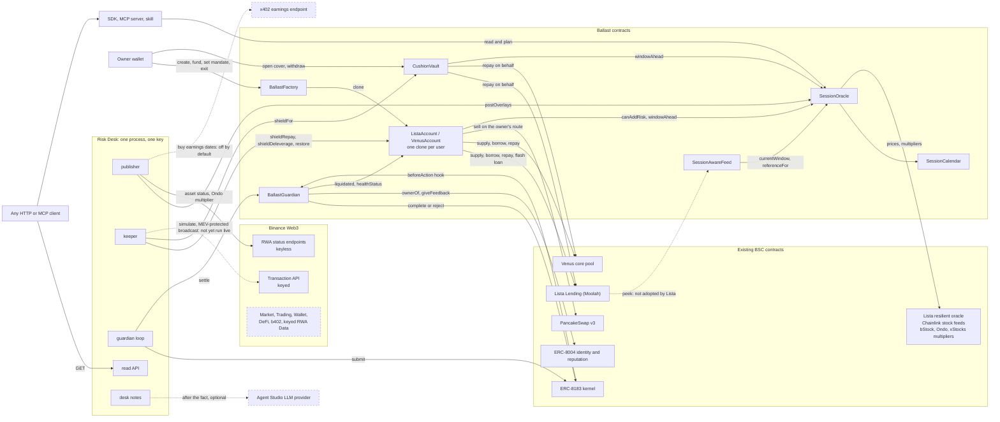

# Ballast

Ballast keeps a loan against tokenized stocks alive through every US market closure: before the close a keeper may only repay or deleverage, and a contract refuses to borrow back until the market has reopened and settled.

It is built for BNB Chain: bStock collateral on Lista Lending and Venus.

| You want | Read |
|---|---|
| To check everything in five minutes | [JUDGES.md](JUDGES.md) |
| Addresses, transactions, test counts | [PROOF.md](PROOF.md), rendered from data by `pnpm proof` |
| The evidence behind each statement | [CLAIMS.md](CLAIMS.md) |
| What is real and what is mocked | [MOCKS.md](MOCKS.md) |
| To use the Session Oracle in your own protocol | [docs/session-oracle.md](docs/session-oracle.md) |

Nothing in this README is a statement about BSC mainnet unless PROOF.md lists the address or the transaction. If PROOF.md says "Mainnet deployment pending", it is pending.

## The measurement

We counted every liquidation of bStock collateral on BNB Chain from the first bStock listing to 25 September 2026 (BSC blocks 101,500,000 to 123,963,563), and measured close-to-open gaps of the underlying stocks over 6.3 years.

- **0 of 120.** None of the 120 bStock liquidations on Lista Lending happened on a weekend (Friday 20:00 to Sunday 20:00 New York time). Venus seized no bStock collateral at all.
- **81%.** Of the dollars repaid in organic liquidations, 81% landed in the first 90 minutes after the regular open; 59% in the first 90 minutes after a weekend or holiday.
- **4.4% / 5.5% / 4.3% / 17.9%.** The 99th-percentile down-gap from one close to the next open: weekday overnight, weekend, holiday, and around earnings (36 US tickers, June 2020 to September 2026).
- **81% of the week.** The NYSE regular session is 32.5 of 168 hours. The tokens trade, and the loans are priced, for the other 81%.

Loans are not lost while the market is shut. Risk builds up while it is closed and is realised when it reopens. So Ballast acts before the close, does not trust the first 90 minutes after the open, and treats earnings as a window of its own.

"Organic" leaves out 87 liquidations of dust-sized positions (about $1.0k in total) that a single account opened at the liquidation threshold. The other 33 repaid $30.6k. These numbers are our own measurement from public data. The scanner and the row-level table are not in this repository; [CLAIMS.md](CLAIMS.md) says what can be re-run and what cannot.

## What Ballast does

1. **One account per loan.** `BallastFactory` creates a per-user account, an EIP-1167 clone of `ListaAccount` or `VenusAccount`, that holds one bStock-collateral loan and a stablecoin cushion. The owner can do everything at any time, sets a mandate (`maxLtvBps`, `shieldLtvBps`, `maxSlippageBps`, `autoRestore`) and names a keeper.
2. **Shield before the close.** In the hour before each regular close, and for the whole session before an earnings gap, the keeper plans for a health factor of 1.05 after the coming window's p99 gap. It repays from the cushion (`shieldRepay`) and, on Lista only, sells collateral into debt through a Moolah flash loan and a PancakeSwap v3 route the owner fixed (`shieldDeleverage`).
3. **Restore after the open.** `restore` borrows back into the cushion only when `SessionOracle.canAddRisk` says yes: regular session, at least 90 minutes after the open, publisher overlay fresh and unflagged, on-chain price within 60 bps of a reference no older than 26 hours, and no closure within 3 hours. On a normal day that is 11:00 to 13:00 New York time. These are the deploy script's parameters; the oracle owner can move them only inside fixed bounds.
4. **Cover without moving the loan.** `CushionVault` holds a cushion for a loan that stays on the user's own address. The keeper can spend it only on that user's debt, only near a closure, and only up to the user's daily cap.
5. **Guardians paid on survival.** A guard job on BNB Chain's ERC-8183 kernel pays a guardian agent that has an ERC-8004 identity only if the account was not liquidated and is healthy after the window. `BallastGuardian` is the job's hook and evaluator and writes the outcome to ERC-8004 reputation.

The Risk Desk (`apps/agent`) is the process that runs this: the overlay publisher, the keeper, the guardian loop and a read API. Every decision in it is deterministic code. Each write is simulated before it is signed, and all sends of the desk key go through one queue. A language model writes a two-sentence note about each shield, restore and refusal afterwards; no code path reads those notes back.

## How it is enforced

The keeper is a hot key on a server. These are the rules it cannot break, because the contract reverts. Names are the ones in `contracts/src`.

**Accounts** (`accounts/BallastAccountBase.sol`, `accounts/ListaAccount.sol`, `accounts/VenusAccount.sol`)

| Rule | Function or modifier | Revert |
|---|---|---|
| The keeper can call three functions. Everything else is the owner's: `borrow`, `withdrawCollateral`, `withdrawCushion`, `setMandate`, `setKeeper`, `setDeleveragePath`, `rescue`. | `onlyOwner`, `onlyKeeperOrOwner` | `NotOwner()`, `NotKeeper()` |
| A repay spends only the account's own balance; debt must fall and collateral must not change. | `shieldRepay(assets)` | `InsufficientCushion(have, need)`, `RiskNotReduced()`, `BelowMinLoan(remaining, minLoan)` |
| A restore needs the Session Oracle's yes. | `restore(assets)` | `RestoreRefused(reason)` |
| A restore borrows to the account itself, never to the caller, and never above the owner's cap. | `restore(assets)` | `ExceedsMandate(ltvBps, maxLtvBps)` |
| The keeper restores only while the owner leaves `autoRestore` on. | `restore(assets)` | `KeeperRestoreDisabled()` |
| A sale uses only the swap path whose hash the owner stored. | `shieldDeleverage(repayAssets, collateralToSell, path, minOut)` | `DeleverageDisabled()`, `BadPath()` |
| A sale happens only above the owner's shield LTV. | `shieldDeleverage` | `BelowShieldLtv(ltvBps, shieldLtvBps)` |
| A sale happens only when the next closure starts within the oracle horizon (3 hours), or while the loan is above the owner's cap. | `shieldDeleverage` | `NotInShieldWindow()` |
| A sale must lower the LTV and may not land more than 100 bps under its floor (the shield LTV in the window, the cap outside it). | `shieldDeleverage` | `RiskNotReduced()`, `OverDeleverage(ltvAfterBps, shieldLtvBps)`, where the second value is the floor |
| The swap must return at least the larger of the caller's `minOut` and the venue oracle value less `maxSlippageBps`. Proceeds go to the account. | `onMoolahFlashLoan` | the router's own revert |
| The flash-loan callback answers only Moolah, and only inside the account's own flash loan. | `onMoolahFlashLoan` | `Unauthorized()` |
| A keeper sale first puts the cushion on the debt in the same transaction and sells nothing if that is enough. A sale that does happen switches `autoRestore` off until the owner sets it again. | `shieldDeleverage` | event `MandateSet(.., false)` |
| The mandate itself is bounded: cap at most 90% and, on Lista, below the market's liquidation LTV; slippage at most 5%; shield LTV below the cap. | `setMandate` | `BadMandate()` |

What a stolen keeper key can do with that: repay debt from the cushion at any time; inside the pre-closure window, sell collateral down to the owner's shield LTV (at most 100 bps under it) at no worse than `maxSlippageBps` under the venue oracle price; borrow back into the cushion when the oracle allows it and the owner left `autoRestore` on. It cannot send a token to any address other than the venue, the owner's swap route and the account itself. Venus accounts have no sale path at all.

**Vault** (`CushionVault.sol`)

| Rule | Function | Revert |
|---|---|---|
| Only the keeper the user named for that cover. | `shieldFor(user, key, amount)` | `NotCoverKeeper()` |
| Not in the regular session while the next closure is known to be more than 3 hours away. | `canShieldNow(symbol)` | `OutsideShieldWindow()` |
| At most `capPerDay` per 24 hours, and only from that user's balance. | `shieldFor` | `OverDailyCap(used, cap)`, `InsufficientCover(have, need)` |
| Only as a repayment of that user's debt on the venue. | `shieldFor` | `NoDebt()`, `BelowMinLoan(remaining, minLoan)` |
| The user withdraws at any time. The vault has no way to borrow. | `withdraw(key, amount, to)` | |

**Session Oracle** (`SessionOracle.sol`, `SessionCalendar.sol`)

| Rule | Function | Revert or answer |
|---|---|---|
| The calendar has no admin and no oracle: constants for 2026 and 2027. Outside them every answer is unknown and risk may not be added. | `SessionCalendar.session(ts)` | `Session.UNKNOWN`, then `Reason.CALENDAR_UNKNOWN` |
| Only the publisher posts overlays. The deploy script refuses to make the owner's address the publisher on mainnet. | `postOverlays(syms, data)` | `NotPublisher()` |
| An overlay lives at most 6 hours. An expired overlay means no. | `postOverlays`, `canAddRisk` | `BadValidity()`, `Reason.OVERLAY_STALE` |
| A posted Ondo multiplier must sit between the on-chain sValue and 100 bps above it. | `postOverlays` | `OndoMultiplierOutOfBounds(posted, onchain)` |
| A posted reference price is accepted only for tickers without a Chainlink feed, only in the regular session, within 300 bps of the on-chain per-share price. | `postOverlays` | `ReferenceNotAllowed()`, `ReferenceOutOfBounds(posted, perShare)` |
| Flags can only block. A posted earnings date can only raise the gap buffer of the window it lands in. | `canAddRisk`, `windowAhead` | `Reason.FLAGGED` |

**Guardian** (`BallastGuardian.sol`)

| Rule | Function | Revert |
|---|---|---|
| Anyone can settle, but only a job the hook bound, after its window, in kernel status Submitted. A job that was never submitted is refunded by the kernel's `claimRefund` at expiry. | `settle(jobId)` | `NotSettleable()`, `WindowNotOver()` |
| The outcome is read from the account, not reported by anyone: `liquidated()`, then `healthStatus()`. Unknown health never settles. | `settle(jobId)` | `CannotEvaluateNow()` |
| At funding: the account comes from the factory and belongs to the client, has debt and no recorded seizure; the window is at least 1 hour and has not started more than 5 minutes ago; the job expires at least 1 hour after the regular open that follows the window; the budget is at least the guardian's minimum; the provider is the owner or agent wallet of the ERC-8004 id in the terms; the client is none of those. | `beforeAction` on `fund` | `BadTerms()`, `NotAccountOwner()`, `BudgetTooLow()`, `ProviderNotAgent()` |
| The provider submits only after the window has ended. | `beforeAction` on `submit` | `WindowNotOver()` |

The tests behind these rows are listed in [PROOF.md](PROOF.md), section 4.

## Architecture



Solid arrows are call paths that exist in the code and are executed by the test suites (unit, or fork against real mainnet state). Whether they also run on mainnet is PROOF.md's job to say, not this diagram's.

Dashed arrows and dashed boxes are in the repository but not wired, off by default, or not yet run against the live service:

- **Lista to SessionAwareFeed.** No lender reads the feed. It is shown on a market created inside a fork test.
- **Keeper to the Transaction API.** Wired in `apps/agent/src/desk/tx.ts`, used only on chain 56 with a key. It has not been run against the live API yet.
- **Publisher to an x402 endpoint.** The buyer exists (`apps/agent/src/desk/x402.ts`, `earnings.ts`) and is off until `X402_EARNINGS_URL` is set. It has never paid a live merchant.
- **Desk notes to an LLM.** On only when the Agent Studio project's LLM provider has a key. Notes are written after the event and never read by a decision.
- **Market, Trading, Wallet, DeFi, b402, keyed RWA Data.** Typed clients with unit tests in `packages/binance`. Nothing calls them.

## The Session Oracle as a primitive

The accounts are one consumer of the Session Oracle. Any lender, vault or agent that prices tokenized US stocks can read the same pieces.

| Piece | What it gives you | Where |
|---|---|---|
| Calendar | The NYSE session at any timestamp (`REGULAR`, `PRE`, `POST`, `OVERNIGHT`, `CLOSED_WEEKEND`, `CLOSED_HOLIDAY`, `UNKNOWN`), the next open and close, the closure ahead and the closure in progress. US Eastern time with DST, holidays and 13:00 early closes for 2026 and 2027, as constants. | `SessionCalendar` |
| Per-share normalisation | One USD price per share of the underlying (`perSharePrice`), from the bStock's raw-unit feed divided by its EIP-8056 `uiMultiplier`. Shares per token for each wrapper (`sharesPerToken`): bStock `uiMultiplier`, xStocks `multiplier`, Ondo from the bounded overlay with the on-chain sValue as a fallback flagged stale. One share price, three token units. | `SessionOracle` |
| Reference and age | The independent reference for a ticker and when it was last updated (`referenceFor`), and whether the on-chain price has converged to it (`converged`). Chainlink for 10 of the 12 listed tickers, a bounded publisher print for the 2 without a feed. | `SessionOracle` |
| Windows and the decision | The next closure and its p99 gap buffer per ticker (`windowAhead`), the closure in progress (`currentWindow`), and one decision: `canAddRisk(symbol)` with a reason code. | `SessionOracle` |
| Lender adapter | A drop-in price source with Lista's oracle interface, `peek(address) returns (uint256)`, 8 decimals, raw token units. In the regular session it passes the upstream price through. While the market is closed it clamps the price to a band around the last reference: the band starts at the ticker's gap buffer for the closure in progress, widens by one base band per 24 hours closed, and is capped at three. | `SessionAwareFeed` |

A fork test creates two identical SPYB/USD1 markets at an 85% liquidation LTV, one priced by Lista's oracle and one by `SessionAwareFeed`, and opens the same loan at health factor 1.043 in each. A -5% print twelve hours after Friday's close liquidates the first and not the second (the band is 334 bps at that hour). The same -5% still standing 90 minutes into Monday's regular session liquidates both: the feed delays a move it cannot confirm, it does not hide one that is real.

```bash
cd contracts && forge test --match-path "test/fork/SessionAwareFeed.fork.t.sol" -vv
```

Interface, read patterns, adapter wiring and the MCP tools are in [docs/session-oracle.md](docs/session-oracle.md).

## Binance Web3 API usage

`packages/binance` is one client for two surfaces: the keyless public RWA endpoints (`src/public.ts`) and the keyed Web3 API with HMAC `X-OC-*` signing (`src/client.ts`, `src/sign.ts`, `src/modules/*`). Every call from either surface is written to a probe (`src/probe.ts`); the desk serves the latency and error-code summary at `/api-health` and the MCP server as the `api_health` tool.

Two of these are wired into the product. The rest is client code with tests and no caller. We list both, so nobody has to find out by grep.

| Module | Endpoints | Called from | What it does there | Without it | Live status |
|---|---|---|---|---|---|
| RWA status, keyless | `assetStatus`, `dynamic` | `apps/agent/src/desk/publisher.ts` (`Publisher`), `packages/mcp/src/tools.ts` (`tokenized_stock_status`) | Per bStock: halt, corporate action, limited-asset and earnings reasons become overlay flags. Per Ondo token: the live shares multiplier, and the underlying price that serves as the reference for tickers without a Chainlink feed. | No overlay is posted for that symbol. The last one expires within 6 hours, `canAddRisk` answers `OVERLAY_STALE`, and restores stop. Shields keep working. | Answers without a key (checked 2026-10-08). Recorded responses in `packages/binance/test/fixtures`. |
| Transaction, keyed | `simulate`, `broadcast` | `apps/agent/src/desk/tx.ts` (`ChainSender`) | Every desk write is simulated here first when a key is set on chain 56. For a restore, a disagreement between this simulator and `eth_call` stops the send. Collateral sales are broadcast here with MEV protection, with the RPC as the fallback. | The desk simulates with `eth_call` and broadcasts through its RPC. It loses the second simulator and the protected route for sales. | Keyed, not verified live. Request shapes and signing are unit-tested; no key was available when this was written. |
| RWA status, keyless | `stockList`, `meta`, `marketStatus`, `klines` | nothing | | | Client and tests only. |
| Transaction, keyed | `gasPrice`, `orders` | nothing | | | Client and tests only. |
| RWA Data, keyed | `platforms`, `price`, `search`, `tokens`, `underlyingProfile`, `underlyingMarket` | nothing (`price` is in the live test) | | | Client and tests only. |
| Market, keyed | `candles`, `price`, `tokenSearch` | nothing | | | Client and tests only. |
| Trading, keyed | `quote`, `swap`, `approveTransaction`, `submitRfqOrder`, `order` | nothing | | | Client and tests only. |
| Wallet, keyed | `allTokenBalances`, `txDetail` | nothing | | | Client and tests only. |
| DeFi, keyed | `positions`, `protocols`, `investments`, `deposit`, `redeem` | nothing | | | Client and tests only. |
| b402, keyed | `supported`, `verify`, `settle` | nothing | | | Client and tests only. The desk's x402 buyer signs EIP-3009 payments itself and does not call these. |

The client also handles what the API asks of a caller: three different success codes, a limit of 5 requests per second per endpoint, retries on 429 that honour `Retry-After`, no retry of a state-changing POST after a timeout, and the geo-block code `40304`, which is recognised and never retried.

The live test for the keyed API is `packages/binance/test/live.test.ts`. It is skipped without `BINANCE_WEB3_API_KEY` and `BINANCE_WEB3_API_SECRET`, which is why `pnpm test` reports 2 skipped.

## Agent Studio, ERC-8004 and ERC-8183

**BNB Agent Studio.** `apps/agent/app/agent` is a Studio project created with `bag init`: `studio.toml`, the A2A and MCP faces, and the Studio signing code, on `@bnbagent/studio-runtime` and `@bnbagent/sdk`. The desk uses three things from it:

- the Studio keystore: the desk key can be a Web3 Secret Storage v3 file from `.studio/wallets`, decrypted with the Studio SDK (`apps/agent/src/desk/account.ts`);
- the Studio LLM configuration: desk notes resolve the `[llm]` provider of `studio.toml` through the Studio runtime (`apps/agent/src/desk/notes.ts`);
- the A2A and MCP faces from `bag dev`, bound to loopback. On chain 56 the desk config refuses any other bind address, because the self-hosted faces have no inbound auth.

It does not use Studio's ERC-8183 seller rail. That rail is switched off in `studio.toml` (`[payments.erc8183] enabled = false`), so the faces advertise no `negotiate` or `notify_funded` skill and nobody can make the desk spend gas on free jobs. Guard jobs go through Ballast's own evaluator instead. The desk is self-hosted under systemd (`deploy/`), not on Studio's managed runtime.

**ERC-8004.** `apps/agent/src/desk/register.ts` mints the desk's identity in the registry at `0x8004a169fb4a3325136eb29fa0ceb6d2e539a432` and writes a registration file with its web, MCP, A2A and wallet endpoints. The id is used in three places on-chain: `SessionOracle.publisherAgentId` names the publisher; `BallastGuardian` requires a job's provider to be the owner or agent wallet of the id in the job terms; and every settlement writes `giveFeedback(agentId, 100 or 0, 0, "ballast-guard", "window", ...)` to the reputation registry at `0x8004baa17c55a88189ae136b182e5fda19de9b63`.

**ERC-8183.** Guard jobs live on BNB Chain's AgenticCommerce kernel at `0xea4daa3100a767e86fded867729ae7446476eba6`. The client calls `createJobWithToken` with `BallastGuardian` as both evaluator and hook, `setBudget`, then `fund` with the terms (account, window start and end, guardian agent id). The hook binds the terms. After the window the provider calls `submit` with a deliverable: the keccak256 of an evidence file holding the desk's own feed events for that account in that window, served byte for byte at `/evidence/<jobId>`. Then anyone calls `BallastGuardian.settle`, which calls `complete` or `reject` on the kernel.

## Quick start

Node 22 or newer, pnpm 9, and Foundry for the contracts.

```bash
git clone --recurse-submodules <repository-url> ballast
cd ballast
pnpm install
pnpm test                                        # TypeScript: SDK, risk model, Binance client, MCP, desk
cd contracts
forge test --no-match-path "test/fork/*"         # contract unit tests, no network
forge test --match-path "test/fork/*"            # fork tests against real BSC mainnet state
```

The fork tests fork BSC at the chain head through `https://bsc-rpc.publicnode.com` and take about 20 seconds after the first compile. Set `BSC_RPC_URL` to use another endpoint, and `FORK_BLOCK` to pin a block (that needs an archive endpoint). `pnpm contracts:test` and `pnpm contracts:test:fork` are the same two commands for a POSIX shell; on Windows use Git Bash or WSL for those, or the `forge` lines above.

Current counts and the date of the last full run are in [PROOF.md](PROOF.md), section 3.

**The backtest**

```bash
pnpm backtest          # replays data/closure-windows.json, rewrites data/backtest-lltv75.json
```

**The fork demo.** One Lista account, one CushionVault cover and one guard job, kept by a desk on a local fork, with the clock moved by hand. It needs an RPC endpoint that keeps serving the forked block for the length of the demo: an archive endpoint or a provider key. The keyless public endpoints stop answering for that block after a few minutes.

```bash
# terminal 1: a local fork of BSC
anvil --fork-url "$BSC_RPC_URL" --chain-id 31337

# terminal 2: build, deploy (anvil account 1 deploys, anvil account 0 is the desk key), then set the scene
cd contracts
forge build
PUBLISHER_ADDRESS=0xf39Fd6e51aad88F6F4ce6aB8827279cffFb92266 forge script script/Deploy.s.sol \
  --rpc-url http://127.0.0.1:8545 --broadcast \
  --private-key 0x59c6995e998f97a5a0044966f0945389dc9e86dae88c7a8412f4603b6b78690d
cd ..
npx tsx scripts/demo/fork-demo.ts setup

# terminal 3: the desk, sending for real on the fork, every loop every 5 seconds
CHAIN_ID=31337 BSC_RPC_URL=http://127.0.0.1:8545 DRY_RUN=false FORK_TICK_SEC=5 \
  AGENT_PRIVATE_KEY=0xac0974bec39a17e36ba4a6b4d238ff944bacb478cbed5efcae784d7bf4f2ff80 pnpm desk

# terminal 2 again: move the clock and watch
npx tsx scripts/demo/fork-demo.ts warp lead      # 59 minutes before the close: the keeper shields
npx tsx scripts/demo/fork-demo.ts warp end       # past the guard window: the desk submits and settles
npx tsx scripts/demo/fork-demo.ts status
curl -s "http://127.0.0.1:8787/feed?limit=20"
```

Both keys are anvil's published development keys and are worth nothing outside a local node. [MOCKS.md](MOCKS.md) lists what the demo replaces on the fork.

**The MCP server.** Eight read and plan tools over stdio or Streamable HTTP. It holds no key and sends nothing.

```bash
BSC_RPC_URL=https://bsc-dataseed.bnbchain.org npx tsx packages/mcp/bin/ballast-mcp.ts            # stdio
BSC_RPC_URL=https://bsc-dataseed.bnbchain.org npx tsx packages/mcp/bin/ballast-mcp.ts --http     # http://127.0.0.1:8787/mcp
```

It reads `contracts/deployments/<CHAIN_ID>.json` and stops with "no deployment for chain 56" while the mainnet deployment is pending. Against the fork above, set `CHAIN_ID=31337 BSC_RPC_URL=http://127.0.0.1:8545`, and pass `--port` in HTTP mode, because the desk's read API already holds 8787.

**The skill.** `skill/SKILL.md` teaches an agent when to call those tools and what not to recommend while `canAddRisk` is false. Copy the `skill` directory into your agent's skills directory and register the MCP server as shown in the file.

**The desk on a server.** `deploy/README.md` is the systemd and Caddy setup. `apps/agent/README.md` has every environment variable. `DRY_RUN` defaults to true: the desk simulates every write and sends nothing until you turn it off.

| Variable | Used by | Meaning |
|---|---|---|
| `BSC_RPC_URL` | fork tests, desk, MCP server, `verify:onchain` | RPC endpoint. The desk treats it as a secret. |
| `FORK_BLOCK` | fork tests | Pin the fork to a block. Unset means the chain head. |
| `CHAIN_ID` | desk, MCP server, `verify:onchain` | `56` for BSC, `31337` for a local fork. |
| `DEPLOYMENT_FILE` | desk, MCP server, `verify:onchain` | Defaults to `contracts/deployments/<CHAIN_ID>.json`. |
| `BINANCE_WEB3_API_KEY`, `BINANCE_WEB3_API_SECRET` | desk, live test | Optional. Unset means keyless endpoints, `eth_call` simulation and plain RPC broadcast. |
| `DRY_RUN` | desk | Defaults to `true`. |

## Repository map

| Path | What is in it |
|---|---|
| `contracts/src` | `SessionCalendar`, `SessionOracle`, `SessionAwareFeed`, `CushionVault`, `BallastGuardian`, `accounts/` (`BallastFactory`, `BallastAccountBase`, `ListaAccount`, `VenusAccount`) |
| `contracts/test` | Unit tests against mocks; `fork/` runs against BSC mainnet state |
| `contracts/script/Deploy.s.sol` | The deploy script. Writes `contracts/deployments/<chainId>.json` on a real broadcast only. |
| `packages/risk` | Calendar mirror of the contract, issuer normalisation, position math, shield and restore planner, backtest |
| `packages/sdk` | Typed reads, the plan bridge from chain state to calls, calldata builders, revert decoding |
| `packages/binance` | Binance Web3 client: keyless RWA endpoints, keyed modules, signing, rate limiter, call probe |
| `packages/mcp` | MCP server with eight read and plan tools |
| `apps/agent/src/desk` | The Risk Desk: publisher, keeper, guardian loop, ledger, x402 buyer, notes, read API |
| `apps/agent/app/agent` | The BNB Agent Studio project: A2A and MCP faces, `studio.toml` |
| `skill` | Agent skill for the MCP tools |
| `scripts` | `proof.ts` (renders PROOF.md), `verify-onchain.ts` (checks a deployment), `demo/fork-demo.ts`, `export-abis.ts` |
| `config` | BSC addresses and per-ticker gap buffers, the NYSE calendar, the operator's earnings schedule |
| `data` | Closure windows of 77 bStocks, the backtest result, and the inputs of PROOF.md |
| `deploy` | systemd unit, environment template and server guide for the desk |

## Honest limits

- **Mainnet.** Nothing is on mainnet unless PROOF.md lists it. The mainnet cycle is planned on a small Venus position. Lista accounts, flash deleverage, the vault on Lista and the feed are proven on a fork of mainnet state, not with a live Lista loan.
- **The damage so far is small.** The 120 liquidations repaid $31.6k in total and left no bad debt. Ballast is built for where the data says the risk concentrates, not in answer to a loss that has already happened.
- **The measurement cannot be re-run from this repository.** The liquidation scanner and its row-level output are not published here. The closure-window dataset and the backtest are.
- **Gap buffers are statistics.** A p99 is exceeded one time in a hundred. In the backtest two shielded positions were still liquidated, both on earnings nights that the dataset does not flag.
- **Earnings dates come from a hand-kept file.** `config/earnings.json` says so itself: every date except one is an estimate. The x402 purchase path that would replace it is off and has never paid a live merchant.
- **One publisher key, one owner.** The overlay publisher is a single bounded key, not an oracle network. `SessionOracle` and `SessionAwareFeed` have an owner who can list tickers, change parameters inside fixed bounds, and replace the price source and the publisher. There is no timelock.
- **The calendar ends on 31 December 2027.** After that it answers unknown and restores stop. The calendar address is immutable in the oracle, so going on means deploying both again.
- **No lender reads SessionAwareFeed.** It is a proposal, shown on a market created in a fork test.
- **Venus accounts cannot sell.** `VenusAccount` has no deleverage function, so near the threshold a Venus account has only its cushion.
- **After a sale the owner acts.** There is no automatic buy-back, and the keeper cannot restore until the owner turns `autoRestore` back on.
- **The owner is not gated.** The owner's own `borrow` works at any hour. The session rules bind the keeper and the `restore` path.
- **One desk, one hot key.** If the process is down, nothing is shielded. The owner can still do everything by hand. An open guard job is then never submitted, and the client claims the refund from the kernel at expiry.
- **Binance keyed API.** Not yet run live from this code. Market, Trading, Wallet, DeFi and b402 have no caller. Binance Agentic Wallet and Wallet Skills are not used.
- **No audit.** The contracts have tests, not an external review.

## License

MIT. See [LICENSE](LICENSE).
